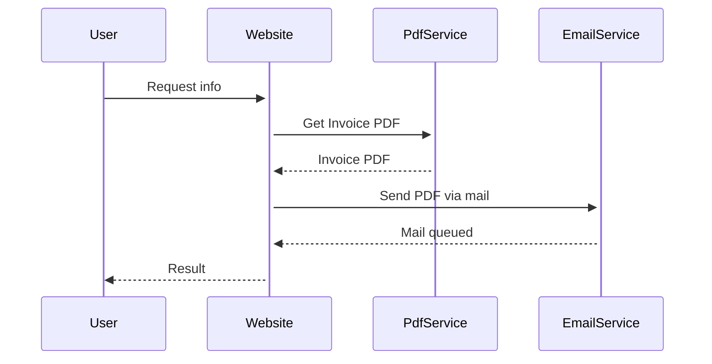

# System Design Interview

## Story

As a user I want to receive an invoice as PDF via mail when I request information via the website,
so that I can process it for billing.

## Problem statement

The PDF generation and mail sending are taking too long. Users want to see the requested information on the website sooner. The invoice itself does not need to be available immediately with the result.

Improve the system architecture to reduce the time users have to wait for their result.

Mail delivery failures or other errors in the processing should be handled. It is important that every user eventually receives an invoice.